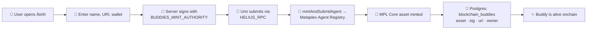

<div align="center">




<p>
  <a href="https://solanaclawd.com"></a>
  <a href="https://www.npmjs.com/package/@openclawdsolana/blockchain-buddies"></a>
  <a href="../README.md"></a>
  <a href="https://x.com/clawddevs"></a>
  <a href="https://core.metaplex.com"></a>
  <a href="LICENSE"></a>
</p>

<a href="https://git.io/typing-svg"></a>

<sub>🦞 part of [OpenClawd](../README.md) · 🌐 [solanaclawd.com](https://solanaclawd.com) · 🪙 `8cHzQHUS2s2h8TzCmfqPKYiM4dSt4roa3n7MyRLApump`</sub>

</div>

---

## 🦞 What is this?

**Blockchain Buddies** is a Solana-native **companion gallery** and **birth station** for OpenClawd agents. Browse 50+ pixel pets, preview every animation state, and **mint a buddy onchain** in a single transaction — Helius RPC + Metaplex Agent Registry + MPL Core asset, all wired up.

Each buddy that's born here gets:

- 🦞 a **registered Metaplex Agent identity** on Solana
- 🐾 a public **MPL Core asset** with metadata + animation pack
- 📦 a downloadable **ZIP** that drops into `~/.openclawd/buddies` or `~/.codex/pets`
- 🪙 an immutable on-chain **birth signature** persisted to Postgres

> Clawd the lobster runs the door. Bring SOL.

---

## 🚀 Quick Start

```bash
# Install deps + launch the gallery
bun install
bun dev
# → http://localhost:3000
```

```bash
# Or skip the gallery and use the CLI to grab a buddy
npx @openclawdsolana/blockchain-buddies list
npx @openclawdsolana/blockchain-buddies install commit-crab
npx @openclawdsolana/blockchain-buddies codex sync commit-crab
```

```bash
# Mint a buddy onchain via the API
curl -X POST http://localhost:3000/api/birth \
  -H 'content-type: application/json' \
  -d '{
    "name": "Snippy",
    "description": "A pinch-happy lobster who never sleeps.",
    "metadataUri": "https://your.cdn/snippy.json",
    "imageUrl": "https://your.cdn/snippy.png",
    "ownerWallet": "<owner-pubkey>"
  }'
```

---

## ✨ Features

| | |
|---|---|
| 🎨 **Browse the gallery** | Approved Blockchain Buddy packs with previews of every animation state. |
| 📥 **One-click downloads** | Each buddy ships as a ZIP under `public/packs`. |
| 🌱 **Submit your own** | Drop a buddy folder in the browser, ship it for review. |
| 🦞 **Onchain birth** | Mint a buddy as a registered **Metaplex Agent** in a single tx. |
| 💾 **Postgres-backed** | Asset address, tx signature, metadata URI, and owner persisted via Drizzle. |
| 🤖 **OpenClawd-aware** | Buddies plug into the OpenClawd agent stack for identity + execution. |
| 🐦 **Codex-compatible** | `~/.codex/pets` sync via the `petdex` legacy alias. |

---

## 🐾 Meet the Buddies

> 50 pixel pets and counting — see [`pets/ideas.json`](pets/ideas.json) for the full roster.

| | | | | |
|---|---|---|---|---|
| 🦞 **Commit Crab** | 🐢 **Token Turtle** | 🐉 **Deploy Dragon** | 🐙 **Ship Squid** | 🦊 **Fiber Fox** |
| 🐧 **Prompt Penguin** | 🐰 **Byte Bunny** | 🐑 **Lambda Lamb** | 🦅 **Cursor Crow** | 🐸 **Figma Frog** |
| 🐹 **Hash Hamster** | 🦎 **Lint Lizard** | 🐼 **Pixel Panda** | 🦦 **Boba Otter** | 🦆 **Captain Quack** |
| 🐺 **Glitch Ghost** | 🐲 **Diff Dino** | 🦒 **Latte Llama** | 🐬 **Schema Seal** | 🦉 **Router Raven** |
| 🦈 **Socket Shark** | 🐳 **Webhook Whale** | 🐯 **Trigger Tiger** | 🐍 **Vault Viper** | 🦘 **Queue Quokka** |

…plus Boxcat, Punchy, Skipper, Bugsy, Cache Capy, Daemon Dumpling, Docker Donut, Envy, Git Goose, Kebo, Merge Mole, Neon Newt, Query Quail, R2 Rover, Render Ram, Stack Sheep, Syntax Sloth, Turbopack Toucan, Vector Vicuna, Worker Wombat, and friends.

<details>
<summary>📜 <b>Full 50-buddy roster</b></summary>

```
Nukey · Boba · Boxcat · Captain Quack · Corsair Cat · Ice Cream Cat · Pelican Pedal · Punchy · Scoop · Skipper
Byte Bunny · Bugsy · Cache Capy · Commit Crab · Cursor Crow · Daemon Dumpling · Deploy Dragon · Diff Dino · Docker Donut · Envy
Fiber Fox · Figma Frog · Git Goose · Glitch Ghost · Hash Hamster · Kebo · Lambda Lamb · Latte Llama · Lint Lizard · Merge Mole
Neon Newt · Pixel Panda · Prompt Penguin · Queue Quokka · Query Quail · R2 Rover · Render Ram · Router Raven · Schema Seal · Ship Squid
Socket Shark · Stack Sheep · Syntax Sloth · Token Turtle · Trigger Tiger · Turbopack Toucan · Vault Viper · Vector Vicuna · Webhook Whale · Worker Wombat
```

</details>

---

## 🌊 Onchain Birth Flow



1. User opens **`/birth`**.
2. Provides a buddy name, description, public Core asset metadata URI, optional image URL, and owner wallet.
3. Server signs with `BUDDIES_MINT_AUTHORITY_SECRET_KEY`.
4. Umi submits through `HELIUS_RPC_URL` or `HELIUS_API_KEY`.
5. `mintAndSubmitAgent` calls `https://api.metaplex.com/v1/agents/mint`, signs the returned tx, and confirms it on Solana.
6. App stores the buddy in `blockchain_buddies` with the **MPL Core asset address** and **tx signature**.

---

## 🧰 Stack

| Layer | What it is |
|---|---|
| **Framework** | Next.js (canary) + React 19 + Tailwind |
| **Runtime** | Bun |
| **DB** | Postgres + Drizzle ORM |
| **Chain** | Solana mainnet via [Helius](https://helius.dev) |
| **Mint** | [Metaplex MPL Core](https://core.metaplex.com) + [Agent Registry](https://www.metaplex.com/agent-registry) |
| **Tx tooling** | `@metaplex-foundation/umi` + `umi-bundle-defaults` |
| **CLI** | [`packages/petdex-cli`](packages/petdex-cli/README.md) — `blockchain-buddies` / `buddies` / `petdex` |

> ⚠️ **This is NOT the Next.js you know.** APIs, conventions, and file structure may differ from your training data. Read `node_modules/next/dist/docs/` before writing code. Heed deprecation notices.

---

## 🔑 Environment

```bash
DATABASE_URL=                              # Postgres connection string
HELIUS_RPC_URL=                            # https://mainnet.helius-rpc.com/?api-key=...
HELIUS_API_KEY=                            # alternative to RPC URL
METAPLEX_AGENT_NETWORK=solana-mainnet      # or solana-devnet
BUDDIES_MINT_AUTHORITY_SECRET_KEY=         # base58 OR JSON array keypair

# Clerk / OAuth
NEXT_PUBLIC_CLERK_PUBLISHABLE_KEY=
CLERK_SECRET_KEY=
CLERK_PUBLIC_KEY=
CLERK_FRONTEND_API_URL=https://clerk.solanaclawd.com
NEXT_PUBLIC_SITE_URL=https://buddies.solanaclawd.com
BLOCKCHAIN_BUDDIES_CLERK_ISSUER=https://clerk.solanaclawd.com
BLOCKCHAIN_BUDDIES_CLERK_CLIENT_ID=
CLERK_OAUTH_CALLBACK_URL=https://buddies.solanaclawd.com/auth/callback
```

> `BUDDIES_MINT_AUTHORITY_SECRET_KEY` accepts **either** a base58 secret key **or** a JSON array keypair (e.g., the contents of `~/.config/solana/id.json`).

OAuth/OIDC provider endpoints for Clerk-as-IdP:

- Discovery: `https://clerk.solanaclawd.com/.well-known/openid-configuration`
- Authorize: `https://clerk.solanaclawd.com/oauth/authorize`
- Token: `https://clerk.solanaclawd.com/oauth/token`
- User info: `https://clerk.solanaclawd.com/oauth/userinfo`
- Token introspection: `https://clerk.solanaclawd.com/oauth/token_info`
- Callback URI: `https://buddies.solanaclawd.com/auth/callback`

**Pre-flight checklist:**

- ✅ A funded Solana mint authority — enough SOL for Core asset rent + tx fees
- ✅ A public metadata JSON URI per buddy
- ✅ `@metaplex-foundation/mpl-agent-registry` v0.2+
- ✅ A reliable Solana RPC (Helius recommended)

---

## 🛠️ Development

```bash
bun install        # install deps
bun dev            # start Next.js dev server
bun run build      # production build
bun run db:push    # apply Drizzle schema to Postgres
```

Buddy packages still live under [`public/pets`](public/pets) for compatibility with the existing animation pipeline. Downloadable archives are generated under `public/packs`.

---

## 📂 Repo Layout

```
blockchain_buddies/
├── 🦞 src/                  # Next.js app — gallery, /birth, API routes
├── 🐾 pets/                 # ideas.json — the 50-buddy roster
├── 📦 public/
│   ├── pets/                # animation packs per buddy
│   ├── packs/               # generated downloadable ZIPs
│   └── brand/               # petdex marks + Clawd lobster SVG
├── 🌊 drizzle/              # SQL migrations
├── 📜 scripts/              # ops + buddy-pack tooling
└── 📡 packages/petdex-cli/  # blockchain-buddies / buddies / petdex CLI
```

---

## 🦀 CLI

The companion CLI ships with **four** integration paths in one package:

```bash
npm i -g @openclawdsolana/blockchain-buddies
blockchain-buddies list
blockchain-buddies install commit-crab
blockchain-buddies codex sync commit-crab
blockchain-buddies metaplex metadata commit-crab --out crab-agent.json
```

Aliases: `buddies` (short), `petdex` (legacy compat).

Full docs → [`packages/petdex-cli/README.md`](packages/petdex-cli/README.md)

---

<div align="center">

### 🦞 Beach with dignity. Code with a buddy.

<sub>part of the **OpenClawd** stack · sovereign AI lobsters on Solana</sub>


</div>
